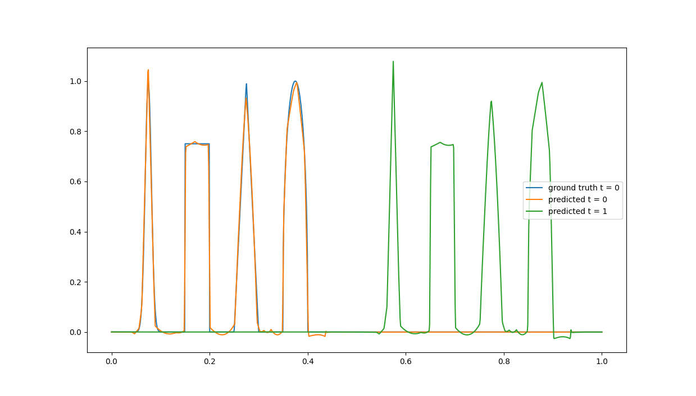

# dgmNet

## About this repository

This repository is an implementation of the PDE-solving Deep Galerkin network designed by [Sirignano and Spiliopoulos 2018](https://arxiv.org/abs/1708.07469).

The solution of a PDE with the form

$\partial_t u(t,x) + \mathcal{L}u(t,x)=0, \quad (t,x) \in [0, T] \times \Omega$

and initial/boundary conditions

$u(0,x) = u_0(x)$ and $u(t,x\in \partial \Omega)=g(t,x)$

can be estimated by minimizing the loss function

$J(f) = ||\partial_tf + \mathcal{L}f||^2_{2,[0,T]\times\Omega} + ||f-g||^2_{2,[0,T]\times\partial\Omega} + ||f(0,.) - u_0||^2_{2,\Omega}$.

This is kind of silly because all we did was take the terms of the PDE and move them to one side of the equation. Could something so simple actually solve complex PDEs? We will find out soon.

A quick note: the authors use complicated multi-stage layers (equation 4.2) which can be summarized as non-linear combinations of fully-connected layers. I have implemented these multistage layers in the class **Slayer**. The input of the network is simply $(t,x) \in \mathbb{R}^{d+1}$ where $d$ is the number of dimensions of $x$. This means $x$ can not only be a point in one-dimensional space, but also high-dimensional parameter space. The point of this paper is to show that this network solves high-dimensional PDEs, but we are only going to look at $x$ as a single coordinate in space.

## User guide
Many parameters can be adjusted in **config.py**. If you wish to add more layers, do so in the custom model class named **DGM** in **dgm.py**. This file also contains the custom loss function class **DGMloss**. The **forward**, **intial_condition**, and **boundary_conditon** methods are where $J(f)$ is implemented. Many presets have been written, but any PDE can be inserted here.

## Results

We solve an advection equation with a speed of 0.5 and $T=1$ to test the network. Here is a Guassian profile advected with diffusion. Looks reasonable!

Let's advect the same profile without diffusion.

Now with a square.

Not so good... We have been using a lighter-weight version of the network with 2 multi-stage layers and 50 features per layer. The authors go up to 6 and 200, respectively. Let's try 3 layers and 100 features per layer.

Better, but here is another idea. Let's return to the lightweight network. Up until now we have been using hyperbolic tangent as our activation function. Let's use ReLU instead because hyperbolic tangent is inherently smooth.

Changing the activation function was more effective than making the network more complex. But, can ReLU perform well when the solution should be smooth?

Yes. Now let's try advecting a more complicated profile.

This is very cool considering we only used a lightweight version of the author's network and were able to generate solutions that at least look correct. Users are encouraged to add additional parameters (e.g., an advection velocity $a \in [-1, 1]$) and implement other PDEs (e.g., the wave equation).

